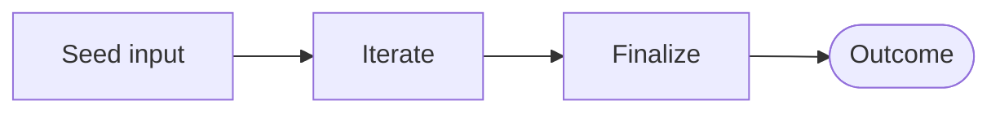
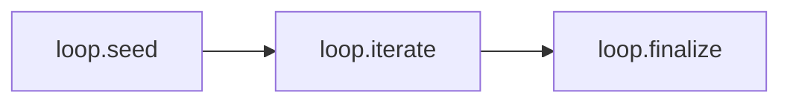

# Recipe: Loop (Iterate + Terminate)

> [!NOTE] > Goal: Iterate safely and explicitly, with a visible termination reason.

Loop is a minimal orchestration recipe. It models “do something N times, then finalize” without hiding
control flow inside user code. It is useful for iterative reasoning, repeated summarization, small batch
experiments, or anytime you want to make iteration explicit in the plan and trace.

Loop is intentionally light: it is a control‑flow skeleton, not a framework. You can swap models, wire in
adapters, and plug it into larger recipes without changing the surface.

---

## 1) Quick start (input + max iterations)

The input is small: a string and an optional max iteration count. Every run returns the standard
`{ status, artefact, diagnostics, trace }` shape. On **ok**, you get `loop.iterations`, `loop.result`, and
`loop.terminationReason` so you can inspect how the loop ended.

::: tabs
== JavaScript

<<< @/snippets/recipes/loop/quick-start.js#docs

== TypeScript

<<< @/snippets/recipes/loop/quick-start.ts#docs

:::

Related: [Runtime Outcomes](/reference/runtime#outcomes) and [Recipes API](/reference/recipes-api).

---

## 2) Configure defaults (typed)

Loop has a small config surface; most of the customization lives in adapters. Use `configure()` to set
recipe‑scoped defaults and `defaults()` to wire adapters. The config is recipe‑specific and typed.

::: tabs
== JavaScript

<<< @/snippets/recipes/loop/defaults.js#docs

== TypeScript

<<< @/snippets/recipes/loop/defaults.ts#docs

:::

---

## 3) Diagnostics + trace

Loop runs with the same diagnostics and trace guarantees as other recipes. Strict mode is useful when you
want to treat missing adapters or invalid inputs as hard failures.

<<< @/snippets/recipes/loop/diagnostics.js#docs

Read more: [Runtime -> Diagnostics](/reference/runtime#diagnostics) and
[Runtime -> Trace](/reference/runtime#trace).

---

## 4) Composition + plan

Loop is a control‑flow building block. It composes cleanly with other recipes and remains inspectable
through the plan API so ordering never becomes magic.

<<< @/snippets/recipes/loop/composition.js#docs

---

## 5) Why Loop is special

Loop makes iteration a first‑class concept with explicit outputs and termination metadata. That keeps your
runtime behaviour inspectable and your orchestration stable even as you swap models or plug in new adapters.

---

## Implementation

- Source: [`src/recipes/loop/index.ts`](https://github.com/theGeekist/llm-core/blob/main/src/recipes/loop/index.ts)
