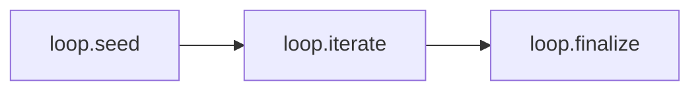

# Recipe: Loop (Iterate + Terminate)

> [!NOTE]
> Goal: Iterate safely and explicitly, with a visible termination reason.

Loop is a small orchestration recipe that focuses on one idea: repeat a step a fixed number of times, then decide how to finish. It models the pattern “do something N times, then finalise” and keeps control flow visible in your own code and in the explain view.

Loop works well when you want clear, auditable behaviour. It gives you a control flow skeleton rather than a full framework. You can swap models, wire in adapters, and connect it to larger recipes while the public surface stays the same.

---

## 1) Quick start: input and max iterations

The input stays intentionally small. You pass in:

- a seed string (for example a question or instruction)
- an optional maximum iteration count

Each run returns the standard outcome shape:

- `status`
- `artefact`
- `diagnostics`
- `trace`

When the outcome is `ok`, the artefact includes a `loop` section. This section exposes `loop.iterations`, `loop.result`, and `loop.terminationReason`. With these fields you can see how many steps ran, what the final value is, and why the loop ended.

::: tabs
== JavaScript

<<< @/snippets/recipes/loop/quick-start.js#docs

== TypeScript

<<< @/snippets/recipes/loop/quick-start.ts#docs

:::

For more detail about how outcomes behave across recipes, see [Runtime Outcomes](/reference/runtime#outcomes) and [Recipes API](/reference/recipes-api).

---

## 2) Configure defaults (typed)

Loop has a compact config surface. It focuses on control flow and delegates most model specific behaviour to adapters.

Use `configure()` to set recipe scoped defaults such as the system prompt or general loop policy. Use `defaults()` to wire in adapters and runtime options. The config is recipe specific and typed, which gives you editor support while you tune behaviour.

Typical tweaks include:

- setting a model that is friendly to short, iterative turns
- defining a system prompt that explains how each step should refine the result
- choosing a reasonable `maxIterations` for your use case

::: tabs
== JavaScript

<<< @/snippets/recipes/loop/defaults.js#docs

== TypeScript

<<< @/snippets/recipes/loop/defaults.ts#docs

:::

---

## 3) Diagnostics and trace

Loop runs with the same diagnostics and trace guarantees as other recipes. Every iteration can contribute entries to the trace, and validation or adapter issues appear in the diagnostics array.

This gives you a clear view of the loop lifecycle. You can see when each step started, which adapters ran, and where a problem occurred if the loop stops earlier than expected. Strict diagnostics mode helps when you treat missing adapters or invalid inputs as hard failures during development and testing.

<<< @/snippets/recipes/loop/diagnostics.js#docs

You can read more about this behaviour in [Runtime: Diagnostics](/reference/runtime#diagnostics) and [Runtime: Trace](/reference/runtime#trace).

---

## 4) Composition and explain

Loop is a control flow building block. You can place it on its own when you need a simple iterative refinement, or you can compose it with other recipes such as RAG or Agent.

The explain API keeps the execution model transparent. A Loop plan shows the seed, the iterate step, and the finalisation step as named nodes. This makes it easy to describe behaviour to team members and to reason about changes over time.

<<< @/snippets/recipes/loop/composition.js#docs

You can start from a single loop recipe and later plug it into a larger workflow. The composition surface remains predictable because the recipe treats iteration as an explicit concern rather than a hidden side effect inside user code.

---

## 5) Why Loop is special

Loop promotes iteration to a first class concept. It provides explicit outputs and termination metadata, which keeps runtime behaviour clear even when models, prompts, or adapters change.

This design suits several patterns:

- iterative reasoning where each step refines a draft
- gradual summarisation of long content over a fixed number of passes
- small batch experiments where you want a fixed budget of attempts

In each case you gain a stable structure: a visible count of iterations, a final result, and a stated termination reason.

---

## Implementation

Source: [`src/recipes/loop/index.ts`](https://github.com/theGeekist/llm-core/blob/main/src/recipes/loop/index.ts)
