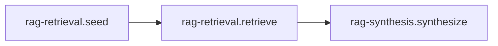

# Recipe: RAG (Retrieval + Synthesis)

> [!NOTE]
> Goal: Answer questions with your own data by composing retrieval and synthesis into a single recipe.

RAG in llm-core joins two clear steps. Retrieval finds the right pieces of data. Synthesis turns those
pieces into an answer that a user can read and trust. You reach for this recipe when you want grounded
responses, reliable citations, and a predictable data path that stays independent of any single
provider SDK.

You can picture RAG as a boundary between knowledge and generation. Retrieval belongs to your product
and your data, while generation belongs to the model. This recipe keeps that boundary explicit and
keeps the flow light to reason about.

Once you wire it in, you can swap retrievers, vector stores, and providers while the recipe surface
stays the same. That is where the adapter work pays off.


You typically use RAG for help centre chat, internal documentation search, policy lookups, audit
trails, and any scenario where a user wants both an answer and a clear sense of where it came from.

---

## 1) Quick start (retriever and model)

Start with a LlamaIndex retriever and an AI SDK model in the same run.

::: code-group

```bash [npm]
npm install ai @ai-sdk/openai llamaindex
```

```bash [pnpm]
pnpm add ai @ai-sdk/openai llamaindex
```

```bash [yarn]
yarn add ai @ai-sdk/openai llamaindex
```

```bash [bun]
bun add ai @ai-sdk/openai llamaindex
```

:::

::: tabs
== JavaScript

<<< @/snippets/recipes/rag/quick-start.js#docs

== TypeScript

<<< @/snippets/recipes/rag/quick-start.ts#docs

:::

Every run returns an object with `status`, `artefact`, `diagnostics`, and `trace`.

When `status` is `"ok"`, the artefact carries `answer.text` and, when you enable them, `citations`.
It also includes retrieval fields such as `retrieval.query`, `retrieval.set`, and `retrieval.reranked`. These fields describe how the answer came together, which query the recipe used in practice, and which documents contributed to that answer.

When the outcome is paused or error, diagnostics and trace stay attached. You can always examine the
path that led to that result.

The RAG pack expects a `retriever` adapter port. When a retriever is present, the recipe performs a
retrieval step before synthesis. When that port is missing, diagnostics call this out and the recipe
moves directly to synthesis.

Input stays minimal. You pass `input` or `query` and the recipe resolves a single retrieval query.
Any richer context, such as user profile or tenant data, lives in your adapters (retrievers,
rerankers, models). This keeps the run input small and predictable.

Related: [Adapters overview](/adapters/), [Runtime Outcomes](/reference/runtime#outcomes), and
[Recipes API](/reference/recipes-api).

---

## 2) Configure per-pack defaults

RAG exposes pack-level defaults for retrieval and synthesis. Use this when you want defaults scoped
to the RAG pack. This is where you set the overall shape of the recipe.

Retrieval defaults cover things like `topK`, reranking behaviour, and which retriever to use.
Synthesis defaults cover prompt framing, response format, and any model options you want to keep
consistent across calls. Run input stays small while config captures the behaviour of the pipeline.

Over time this becomes the place where teams agree on tone, length, and structure of answers, while day-to-day usage still looks like a simple `run({ input })` call.

::: tabs
== JavaScript

<<< @/snippets/recipes/rag/defaults.js#docs

== TypeScript

<<< @/snippets/recipes/rag/defaults.ts#docs

:::

Recipe handles expose a `configure` surface for this pattern. You keep a single recipe instance,
then call it with different defaults for different environments or products. For example, you can
point staging at a lower cost model and production at a higher quality model.

If you want strict enforcement, set `runtime.diagnostics = "strict"`. Missing retrievers,
reranker requirements, and schema issues then register as errors instead of warnings.

Why this exists: [Recipe handles -> configure](/reference/recipes-api#recipe-handles-the-public-surface).

---

## 3) Mix and match adapters

The recipe surface works with any adapter that satisfies the expected ports. Your application talks to a single RAG recipe, while the actual model, retriever, and stores live behind adapters that you can replace or upgrade independently. You can upgrade your model, for example from `gpt-4` to `gpt-4.1` or `gpt-4.1-mini`, and keep the same vector store
configuration. You can also swap vector stores, for example from an in-memory store to Pinecone,
while your prompts and recipe calls stay the same.

This is where the retrieval adapters from AI SDK, LangChain, LlamaIndex, and the primitives pack
come together. Each ecosystem provides its own model, retriever, vector store, or query engine
abstractions. The RAG recipe treats them all through the same adapter ports.

You can override adapters per run instead of rebuilding the recipe. This makes fallbacks and
experiments easy.

```ts
await rag.run(
  { input: "Explain this error" },
  {
    adapters: {
      model: fastModel,
      retriever: preciseRetriever,
    },
  },
);
```

To make the combinations more concrete:

| Layer        | Example from adapters            |
| ------------ | -------------------------------- |
| Model        | AI SDK `openai("gpt-4o-mini")`   |
| Retriever    | LangChain `VectorStoreRetriever` |
| Vector store | LlamaIndex document store        |
| Store        | Primitives KV or cache store     |

You can start with a simple in-process setup and later move to hosted or managed stores while the
recipe usage in your app code stays stable.

---

## 4) Diagnostics and trace

Diagnostics and trace attach to every outcome. Strict diagnostics mode promotes certain conditions
into errors so you see them early in development.

This is where missing retrievers, unresolved reranker requirements, or schema problems show up with
clear messages.

<<< @/snippets/recipes/rag/diagnostics.js#docs

Related: [Runtime -> Diagnostics](/reference/runtime#diagnostics) and
[Runtime -> Trace](/reference/runtime#trace).

---

## 5) Sub-recipes and explain view

RAG exposes two public sub-recipes. You can run them independently or inspect the explain output.



<<< @/snippets/recipes/rag/composition.js#docs

The retrieval side handles query construction, adapter calls, and collection of candidates.
The synthesis side takes the retrieved items, builds a prompt, and produces an answer with
citations when you configure that behaviour.

RAG composes cleanly with other recipes. It often sits inside
[Agent](/recipes/agent) so tool calls and retrieval run in a single flow, or inside
[HITL](/recipes/hitl) when you want a human check before final answers. When you need to build
indexes first, pair it with [Ingest](/recipes/ingest).

The explain view shows each of these steps as part of the plan. This keeps the sequence of
operations visible and traceable.

---

## 6) Why RAG is special

RAG acts as the main knowledge pipeline in many systems. It is the place where interoperability
matters most because retrievers, rerankers, vector stores, and models all move at their own pace.

The recipe gives you a consistent surface across those changes. You can plug in a model from AI SDK,
a retriever from LangChain, and a store from LlamaIndex or the primitives pack. The recipe structure
and the way you call it remain the same.

This clear boundary between knowledge and generation also helps teams. Product owners can think in
terms of data sources and retrieval quality. ML or platform teams can focus on model choice and
prompt design. Everyone shares one RAG recipe.

Most importantly, RAG encourages a habit where the question “where did this answer come from” has a
real, inspectable answer in diagnostics, trace, and citations.

---

## Implementation

- Source: [`src/recipes/rag/index.ts`](https://github.com/theGeekist/llm-core/blob/main/src/recipes/rag/index.ts)
- Retrieval pack: [`src/recipes/rag/retrieval`](https://github.com/theGeekist/llm-core/blob/main/src/recipes/rag/retrieval)
- Synthesis pack: [`src/recipes/rag/synthesis`](https://github.com/theGeekist/llm-core/blob/main/src/recipes/rag/synthesis)
