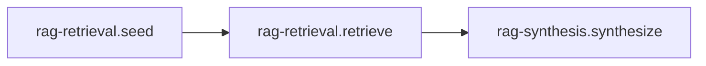

# Recipe: RAG (Retrieval + Synthesis)

> [!NOTE] > Goal: Answer questions using private data by composing retrieval and synthesis into a single recipe.

RAG in llm-core composes two steps: retrieval fetches relevant documents, synthesis turns them into an answer.
You reach for it when you want grounded answers, consistent citations, and a repeatable data path that does
not depend on any one provider’s SDK.

Think of RAG as a durable boundary between “knowledge” and “generation.” Retrieval is a product feature,
not a model feature, and this recipe keeps that boundary explicit without making it heavy.
The promise: the same recipe surface while you swap retrievers, vector stores, and providers.

You typically use RAG for help‑center Q&A, internal documentation search, policy lookups, audit trails,
and any scenario where “show me where this came from” matters as much as the answer itself.

---

## 1) Quick start (retriever + model)

Use a LangChain retriever and an AI SDK model in the same run.

::: tabs
== JavaScript

<<< @/snippets/recipes/rag/quick-start.js#docs

== TypeScript

<<< @/snippets/recipes/rag/quick-start.ts#docs

:::

Every run returns `{ status, artefact, diagnostics, trace }`.
On **ok**, the artefact includes `answer.text` and (when configured) `citations`, plus retrieval keys
like `retrieval.query`, `retrieval.set`, and `retrieval.reranked` that explain how the answer was formed.
**paused** and **error** outcomes keep diagnostics and trace attached, so you never lose the “why”.

**Adapter requirement:** the RAG pack expects a `retriever` adapter port. Without it, the flow will
emit diagnostics and skip retrieval.

Input stays minimal: pass `input` or `query`, and the recipe resolves a single retrieval query.
If you need richer context, it belongs in adapters (retrievers, rerankers, models), not in the run input.

Related: [Adapters overview](/adapters/), [Runtime Outcomes](/reference/runtime#outcomes), and
[Recipes API](/reference/recipes-api).

---

## 2) Configure per-pack defaults (typed)

RAG exposes pack-level defaults for **retrieval** and **synthesis**. Use this when you want defaults scoped
to a pack. This is where you set the “shape” of RAG: retrieval knobs (topK, reranking) and synthesis behavior
(prompt, response format) live here, while run input stays small and consistent.
Treat config as **behaviour** (how retrieval and synthesis run), not extra input.

::: tabs
== JavaScript

<<< @/snippets/recipes/rag/defaults.js#docs

== TypeScript

<<< @/snippets/recipes/rag/defaults.ts#docs

:::

Why this exists: [Recipe handles -> configure](/reference/recipes-api#recipe-handles-the-public-surface).

If you want strict enforcement, run with `runtime.diagnostics = "strict"` so missing retrievers,
reranker requirements, or schema issues become errors instead of warnings.

---

## 3) Mix-and-match adapters

The recipe surface is adapter-agnostic. This allows you to upgrade your model (e.g. gpt-4 -> gpt-5) without touching your vector store, or swap vector stores (Memory -> Pinecone) without breaking your prompt logic.

::: tabs
== JavaScript

<<< @/snippets/recipes/rag/adapters.js#docs

== TypeScript

<<< @/snippets/recipes/rag/adapters.ts#docs

:::

You can override adapters per run without rebuilding the recipe, which makes fallbacks and experiments
simple: `rag.run(input, { adapters: { model: fastModel } })`.

---

## 4) Diagnostics + trace

Diagnostics and trace are always attached. Strict mode turns requirement warnings into failures.
This is where missing retrievers, reranker requirements, or schema problems show up early and clearly.

<<< @/snippets/recipes/rag/diagnostics.js#docs

Related: [Runtime -> Diagnostics](/reference/runtime#diagnostics) and [Runtime -> Trace](/reference/runtime#trace).

---

## 5) Power: sub-recipes + explain

RAG exposes two public sub-recipes. You can run them independently or inspect the explain output.

<<< @/snippets/recipes/rag/composition.js#docs

RAG composes cleanly with other recipes. It is most often plugged into [Agent](/recipes/agent) so tool calls
and retrieval happen in one flow, or gated with [HITL](/recipes/hitl) when you want a human check before final
answers. If you need to build indexes first, pair it with [Ingest](/recipes/ingest).

The mental model is simple: adapters are swappable, the explain output is explicit, and every run tells you how the
answer was formed. There are no hidden steps or invisible defaults.

---

## 6) Why RAG is special

RAG is the canonical knowledge pipeline: it’s where interoperability matters most because retrievers,
rerankers, vector stores, and models all evolve independently.

It’s also the easiest place to mix-and-match adapters: a model from AI SDK, a retriever from LangChain,
and a store or query engine from elsewhere — without changing the recipe surface.

Most importantly, it draws a clean boundary between knowledge and generation, so “show me where this came
from” is part of the system, not an afterthought.

---

## Implementation

- Source: [`src/recipes/rag/index.ts`](https://github.com/theGeekist/llm-core/blob/main/src/recipes/rag/index.ts)
- Retrieval pack: [`src/recipes/rag/retrieval`](https://github.com/theGeekist/llm-core/blob/main/src/recipes/rag/retrieval)
- Synthesis pack: [`src/recipes/rag/synthesis`](https://github.com/theGeekist/llm-core/blob/main/src/recipes/rag/synthesis)
