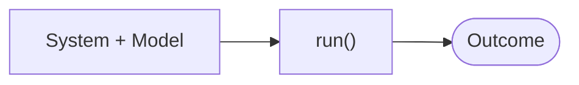

# Recipe: Simple Chat (Preset + Base Handle)

> [!NOTE] > Goal: A minimal, low-friction entry point that wires model/system defaults.

Simple Chat is intentionally small: it **does not introduce extra steps**. Instead, it provides a
recipe handle that sets model/system defaults and can be composed into richer flows. You use it when
you want a clean baseline: quick assistants, prototypes, or a stable fallback before you add RAG or tools.

If you want a full agentic loop, see [Agent](/recipes/agent). If you want RAG + chat, see
[RAG](/recipes/rag).

---

## 1) Quick start (system + model defaults)

::: tabs
== JavaScript

<<< ../snippets/recipes/simple-chat/quick-start.js#docs

== TypeScript

<<< ../snippets/recipes/simple-chat/quick-start.ts#docs

:::

Outcomes are explicit: `{ status, artefact, diagnostics, trace }`. A successful run carries
`answer.text` in the artefact; paused and error outcomes keep the same trace and diagnostics so you
can always explain what happened.
If you see `model: "gpt-4o-mini"` in config, think of it as a label/selector for the recipe surface;
the actual inference happens through the adapter you pass in defaults.

Related: [Recipes API](/reference/recipes-api), [Runtime Outcomes](/reference/runtime#outcomes), and
[Adapters overview](/adapters/).

---

## 2) Configure and tune (common tweaks)

Simple Chat accepts a recipe‑specific config that stays intentionally small: a system prompt,
model defaults, and any response formatting you want to standardize. This is where you set
the “voice” of your app. If you want strict enforcement, run with `runtime.diagnostics = "strict"`
so missing adapters or schema mismatches fail early.

---

## 3) Streaming (the cleanest place to learn it)

This is the simplest recipe to experiment with streaming. Streaming lives on the **model adapter**,
and you can use the same adapter you already wired into the recipe. That gives you streaming output
without changing the recipe’s outcome guarantees.

<<< ../snippets/recipes/simple-chat/streaming.js#docs

See: [Models -> Streaming](/adapters/models#the-streaming-lifecycle).

---

## 4) Use it as a base (compose with other recipes)

Because Simple Chat only wires defaults, pair it with another recipe's steps.

<<< ../snippets/recipes/simple-chat/compose.js#docs

---

## 5) Diagnostics + trace

Even when used as a preset, you still get full diagnostics and trace from the composed recipe.

<<< ../snippets/recipes/simple-chat/diagnostics.js#docs

Related: [Runtime -> Diagnostics](/reference/runtime#diagnostics) and
[Runtime -> Trace](/reference/runtime#trace).

---

## 6) Plan (explicit, single step)

Even in its simplest form, the explain view is visible. This keeps “no hidden steps” as a constant.

---

## 7) Why Simple Chat is special

Simple Chat is the canonical “hello world” recipe. It is the quickest way to validate adapters,
diagnostics, and streaming without any other moving parts, and it gives you a stable baseline
before you move to RAG or agentic flows.

---

## Implementation

- Source: [`src/recipes/simple-chat.ts`](https://github.com/theGeekist/llm-core/blob/main/src/recipes/simple-chat.ts)
