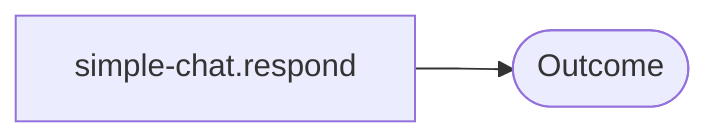

# Recipe: Simple Chat (Preset + Base Handle)

> [!NOTE]
> Goal: A minimal entry point that wires model and system defaults into a reusable handle.

Simple Chat is a compact recipe for straight‑line chat. It wires your system prompt and model choice into a preset handle and keeps the flow itself very small. You reach for it when you want a clean baseline: quick assistants, prototypes, or a stable fallback before you bring in RAG or tools.

For a full agentic loop, see [Agent](/recipes/agent). For RAG plus chat, see [RAG](/recipes/rag).


---

## 1) Quick start (system and model defaults)

::: code-group

```bash [npm]
npm install ai @ai-sdk/openai
```

```bash [pnpm]
pnpm add ai @ai-sdk/openai
```

```bash [yarn]
yarn add ai @ai-sdk/openai
```

```bash [bun]
bun add ai @ai-sdk/openai
```

:::

::: tabs
== JavaScript

<<< ../snippets/recipes/simple-chat/quick-start.js#docs

== TypeScript

<<< ../snippets/recipes/simple-chat/quick-start.ts#docs

:::

The recipe returns a structured outcome object: `{ status, artefact, diagnostics, trace }`. When the run succeeds, the artefact carries an `answer.text` field. Paused and error outcomes reuse the same trace and diagnostics so every run remains explainable.

If you see `model: "gpt-4o-mini"` in a config block, treat it as a label for the recipe surface. Actual inference happens through the adapter you pass in defaults.

Related: [Recipes API](/reference/recipes-api), [Runtime outcomes](/reference/runtime#outcomes), and [Adapters overview](/adapters/).

---

## 2) Configure and tune (common tweaks)

Simple Chat accepts a small recipe config: a system prompt, model defaults, and any response formatting you want to standardise. This config gives the application its voice and makes behaviour repeatable across runs.

For stricter guarantees, set `runtime.diagnostics = "strict"` in the runtime options so adapter issues or schema mismatches surface immediately.

---

## 3) Streaming (the cleanest place to learn it)

Simple Chat is the easiest recipe for learning how streaming behaves. Streaming lives on the **model adapter**, and you can use the same adapter that you already wired into the recipe. That gives you streaming output while the outcome shape stays the same.

<<< ../snippets/recipes/simple-chat/streaming.js#docs

See [Models: streaming](/adapters/models#the-streaming-lifecycle) for the full adapter-side lifecycle.

---

## 4) Use it as a base (compose with other recipes)

Simple Chat works well as a base recipe. It sets shared defaults and delegates the rest of the work to other recipes.

Common patterns:

- Run Simple Chat for the first response, then hand off to [Agent](/recipes/agent) for multi‑step tool usage.
- Pair Simple Chat with [RAG](/recipes/rag) so you capture a clean conversational answer while a retrieval step prepares context in the background.
- Use it as a fallback when other recipes fail strict validation, since the handle stays very small and predictable.

<<< ../snippets/recipes/simple-chat/compose.js#docs

The key idea is that Simple Chat stabilises how the model sees system and user input. Other recipes then add retrieval, tools, memory, or evaluation around that stable core.

---

## 5) Diagnostics and trace

Even when you treat Simple Chat as a preset, you still get full diagnostics and trace from the composed recipe. The outcome structure does not change, which means higher level code can inspect results in a consistent way across different recipes.

<<< ../snippets/recipes/simple-chat/diagnostics.js#docs

Related: [Runtime diagnostics](/reference/runtime#diagnostics) and [Runtime trace](/reference/runtime#trace).

---

## 6) Plan view (explicit single step)

Simple Chat participates fully in the explain view. Even this smallest recipe exposes its step as `simple-chat.respond`, which keeps the step list visible for every run.



This makes it easier to debug adapters and runtime behaviour because you can see exactly which step executed and which outcome it produced.

---

## 7) Why Simple Chat is special

Simple Chat is the canonical “hello world” recipe. It gives you a fast way to validate adapters, diagnostics, streaming, and runtime wiring with very little configuration. The outcome object matches the structure used by richer recipes, so once Simple Chat feels comfortable you can migrate to RAG or agentic flows with the same mental model.

In practice, many applications begin with Simple Chat in development and keep it around in production for health checks, smoke tests, or a safe fallback path.

---

## Implementation

Source: [`src/recipes/simple-chat.ts`](https://github.com/theGeekist/llm-core/blob/main/src/recipes/simple-chat.ts)
