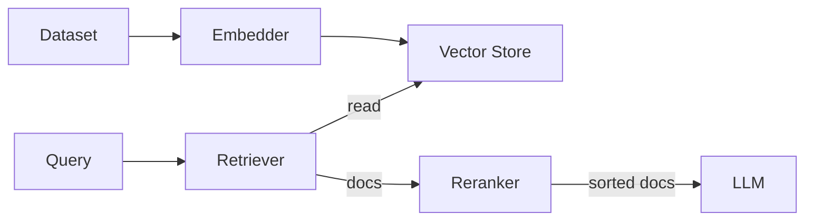

# Retrieval Adapters (Context & Memory)

## What is Retrieval?

Retrieval is the mechanism for giving your LLM "Long-Term Memory" or access to private data. It is the core of **RAG** (Retrieval-Augmented Generation).

In `llm-core`, retrieval is not a single capability. It is a pipeline of four distinct stages:

1.  **Embedders**: Turn text into math (vectors).
2.  **Vector Stores**: Save (Ingest) those vectors for later.
3.  **Retrievers**: Read (Query) relevant vectors during a workflow.
4.  **Rerankers**: Refine the results using a high-precision model.

### The RAG Pipeline



---

## 1. Retrievers

**The Reading Interface**

A `Retriever` takes a string query and returns a list of Documents. It is **Read-Only**.

### When to use what?

- **LlamaIndex (`fromLlamaIndexRetriever`)**: **Best for complex data.**
  If you are parsing PDFs, building Knowledge Graphs, or using hierarchical indices, LlamaIndex is the gold standard. Use their retrievers to tap into that complexity.

  - _Upstream Docs_: [`BaseRetriever`](https://ts.llamaindex.ai/api/classes/BaseRetriever)

- **LangChain (`fromLangChainRetriever`)**: **Best for broad database support.**
  If you need to connect to a specific database (Pinecone, Chroma, qdrant) and do a simple similarity search, LangChain likely has the driver you need.
  - _Upstream Docs_: [`BaseRetriever`](https://api.js.langchain.com/classes/core_retrievers.BaseRetriever.html)

---

## 2. Vector Stores

**The Writing Interface**

While a Retriever _reads_, a `VectorStore` adapter _writes_. It allows `llm-core` to **Upsert** (Add/Update) and **Delete** documents in a database-agnostic way.

### Why use an adapter?

Every vector DB SDK has a different API for adding records. `llm-core` normalizes this so you can write a generic **Ingestion Recipe** that works with _any_ backed storage.

### Example: Indexing a Document

Here is how you wire up a LangChain Memory store to ingest data:

::: tabs
== TypeScript

```ts
import { fromLangChainVectorStore } from "@geekist/llm-core/adapters";
import type { VectorStore } from "@geekist/llm-core/adapters";
import { MemoryVectorStore } from "langchain/vectorstores/memory";
import { OpenAIEmbeddings } from "@langchain/openai";

// 1. Wrap the ecosystem Store
const store: VectorStore = fromLangChainVectorStore(new MemoryVectorStore(new OpenAIEmbeddings()));

// 2. Use it in an Ingestion Workflow
interface MyDoc {
  id: string;
  text: string;
  metadata: { author: string };
}

await store.upsert({
  documents: [
    { id: "doc-1", text: "Jason likes coffee.", metadata: { author: "Jason" } },
    { id: "doc-2", text: "Jason hates tea.", metadata: { author: "Jason" } },
  ] as MyDoc[],
});
```

== JavaScript

```js
import { fromLangChainVectorStore } from "@geekist/llm-core/adapters";
import { MemoryVectorStore } from "langchain/vectorstores/memory";
import { OpenAIEmbeddings } from "@langchain/openai";

// 1. Wrap the ecosystem Store
const store = fromLangChainVectorStore(new MemoryVectorStore(new OpenAIEmbeddings()));

// 2. Use it in an Ingestion Workflow
await store.upsert({
  documents: [
    { id: "doc-1", text: "Jason likes coffee.", metadata: { author: "Jason" } },
    { id: "doc-2", text: "Jason hates tea.", metadata: { author: "Jason" } },
  ],
});
```

:::

---

## 3. Indexing (The Sync Problem)

**Why isn't `store.upsert` enough?**

Naive RAG pipelines blindly upsert documents every time they run. This is dangerous because:

1.  **Cost**: You pay to re-embed text that hasn't changed.
2.  **Duplicates**: If a file moves or changes slightly, you might get ghost records.
3.  **Deletions**: If you delete a source file, the vector stays in the DB forever (hallucination risk).

**The Solution: Indexing Adapters**

An Indexing Adapter sits between your Source and your Vector Store. It tracks a hash of every document to ensure strict synchronization.

`Source Docs` -> **`Indexing Adapter`** -> `Vector Store`

### Integrations

**LangChain (`RecordManager`)**

LangChain's Record Manager is the industry standard for this pattern. Our adapter expects a **LangChain VectorStore** instance (not the llm-core `VectorStore` adapter). You can still mix-and-match models and other adapters in the workflow, but indexing itself is currently LangChain-native.

::: tabs
== TypeScript

```ts
import { Adapter, fromLangChainIndexing } from "@geekist/llm-core/adapters";
import type { Indexing, IndexingResult } from "@geekist/llm-core/adapters";

// 1. Define the Indexing logic
const indexing: Indexing = Adapter.indexing(
  "custom.indexing",
  fromLangChainIndexing(recordManager, langChainVectorStore),
);

// 2. Run the sync job
const result: IndexingResult = await indexing.index({
  documents: myDocs,
  options: {
    cleanup: "full",
    sourceIdKey: "source",
  },
});
```

== JavaScript

```js
import { Adapter, fromLangChainIndexing } from "@geekist/llm-core/adapters";

// 1. Define the Indexing logic
const indexing = Adapter.indexing(
  "custom.indexing",
  fromLangChainIndexing(recordManager, langChainVectorStore),
);

// 2. Run the sync job
const result = await indexing.index({
  documents: myDocs,
  options: {
    cleanup: "full",
    sourceIdKey: "source",
  },
});
```

:::

---

## 4. Embedders

**The Meaning Maker**

Embedders are the hidden workhorses of RAG. They convert "Hello World" into a massive array of numbers (e.g., `[0.1, -0.4, 0.8...]`).

### Dimensions Matter

When choosing an embedder, you must ensure the **dimensions** (e.g., 1536 for OpenAI `text-embedding-3-small`) match your Vector Store configuration.

### Ecosystem Support

- **AI SDK (`EmbeddingModel`)**: **Recommended for speed.**
  The AI SDK provides a clean, Type-Safe interface for modern providers like OpenAI, Cohere, and Mistral.

  - _Upstream_: [`EmbeddingModel`](https://sdk.vercel.ai/docs/reference/ai-sdk-core/embedding-model-v1)

- **LangChain / LlamaIndex**: Useful if you are using their document splitting chains, as they often require their own `Embeddings` instances to be passed in.

::: tabs
== TypeScript

```ts
import { fromAiSdkEmbeddings } from "@geekist/llm-core/adapters";
import type { Embedder } from "@geekist/llm-core/adapters";
import { openai } from "@ai-sdk/openai";

// Create an embedder capable of batching
const embedder: Embedder = fromAiSdkEmbeddings(openai.embedding("text-embedding-3-small"));

// Embed a batch of text
const vectors: number[][] = await embedder.embedMany(["Hello", "World"]);
```

== JavaScript

```js
import { fromAiSdkEmbeddings } from "@geekist/llm-core/adapters";
import { openai } from "@ai-sdk/openai";

// Create an embedder capable of batching
const embedder = fromAiSdkEmbeddings(openai.embedding("text-embedding-3-small"));

// Embed a batch of text
const vectors = await embedder.embedMany(["Hello", "World"]);
```

:::

---

## 4. Rerankers

**The Precision Refiner**

Vector similarity is "fuzzy"—it finds things that _sound_ alike, but not always things that _answer_ the question. A Reranker takes the top (e.g., 50) results from a Retriever and uses a much smarter (but slower) model to sort them by actual relevance.

### Why Rerank?

It significantly improves answer quality (reduces hallucinations) by ensuring the LLM only sees the absolute best context.

### Implementation

We align with the **AI SDK Reranker** standard (`RerankingModelV3`).

::: tabs
== TypeScript

```ts
import { fromAiSdkReranker } from "@geekist/llm-core/adapters";
import type { Reranker, Document } from "@geekist/llm-core/adapters";
import { cohere } from "@ai-sdk/cohere"; // Example provider

const reranker: Reranker = fromAiSdkReranker(cohere.reranker("rerank-english-v3.0"));

// In a custom recipe step:
const refinedDocs: Document[] = await reranker.rerank(userQuery, retrievedDocs);
```

== JavaScript

```js
import { fromAiSdkReranker } from "@geekist/llm-core/adapters";
import { cohere } from "@ai-sdk/cohere"; // Example provider

const reranker = fromAiSdkReranker(cohere.reranker("rerank-english-v3.0"));

// In a custom recipe step:
const refinedDocs = await reranker.rerank(userQuery, retrievedDocs);
```

:::

---

## 5. Structured Queries (LangChain only)

**The Filter Compiler**

LangChain exposes a `StructuredQuery` type used by self-query retrievers and structured filters.
We normalize it so you can keep the same filter shape while mixing in **any** model adapter.

::: tabs
== TypeScript

```ts
import { StructuredQuery as LangChainStructuredQuery } from "@langchain/core/structured_query";
import { fromLangChainStructuredQuery } from "@geekist/llm-core/adapters";
import type { StructuredQuery } from "@geekist/llm-core/adapters";

const lcQuery = new LangChainStructuredQuery("find docs", {
  type: "comparison",
  comparator: "eq",
  attribute: "category",
  value: "policies",
});

const query: StructuredQuery = fromLangChainStructuredQuery(lcQuery);
```

== JavaScript

```js
import { StructuredQuery as LangChainStructuredQuery } from "@langchain/core/structured_query";
import { fromLangChainStructuredQuery } from "@geekist/llm-core/adapters";

const lcQuery = new LangChainStructuredQuery("find docs", {
  type: "comparison",
  comparator: "eq",
  attribute: "category",
  value: "policies",
});

const query = fromLangChainStructuredQuery(lcQuery);
```

:::

You can pass the resulting `StructuredQuery` into your own retriever filters or recipe steps,
regardless of whether your **Model** adapter comes from AI SDK, LangChain, or LlamaIndex.

---

## 6. Query Engines (The "Black Box")

**When to use a Query Engine?**

In `llm-core`, we usually encourage you to build **Recipes**—explicit workflows where you control the `Retrieve -> Rerank -> Generate` chain.

However, frameworks like LlamaIndex offer pre-packaged "Engines" that encapsulate highly complex retrieval logic (e.g., Sub-Question Query Engines, Multi-Step Reasoning).

Use a **Query Engine Adapter** when:

1.  You want to use a specific, advanced LlamaIndex strategy.
2.  You don't want to reimplement the orchestration logic yourself.
3.  You treat the retrieval subsystem as an opaque "Oracle".

::: tabs
== TypeScript

```ts
import { Adapter, fromLlamaIndexQueryEngine } from "@geekist/llm-core/adapters";
import type { QueryEngine, QueryResult } from "@geekist/llm-core/adapters";

// 1. Create the complex engine upstream
const complexEngine = /* any LlamaIndex query engine instance */;

// 2. Wrap it as a simple "Query In -> Answer Out" adapter
const queryEngine: QueryEngine = Adapter.queryEngine(
  "my.complex.engine",
  fromLlamaIndexQueryEngine(complexEngine)
);

// 3. Use it in your workflow
const result: QueryResult = await queryEngine.query({ text: "Compare Q1 revenue for Apple and Google" });
console.log(result.text);
```

== JavaScript

```js
import { Adapter, fromLlamaIndexQueryEngine } from "@geekist/llm-core/adapters";
import { SubQuestionQueryEngine } from "llamaindex";

// 1. Create the complex engine upstream
const complexEngine = SubQuestionQueryEngine.fromDefaults({ ... });

// 2. Wrap it as a simple "Query In -> Answer Out" adapter
const queryEngine = Adapter.queryEngine(
  "my.complex.engine",
  fromLlamaIndexQueryEngine(complexEngine)
);

// 3. Use it in your workflow
const result = await queryEngine.query({ text: "Compare Q1 revenue for Apple and Google" });
console.log(result.text);
```

:::

### Response Synthesizers

A **Response Synthesizer** takes a query and a set of retrieved nodes, and generates a final response. It is the "Generation" half of RAG.

::: tabs
== TypeScript

```ts
import { Adapter, fromLlamaIndexResponseSynthesizer } from "@geekist/llm-core/adapters";
import type { ResponseSynthesizer } from "@geekist/llm-core/adapters";

const synthesizer: ResponseSynthesizer = Adapter.responseSynthesizer(
  "custom.responseSynthesizer",
  fromLlamaIndexResponseSynthesizer(synthesizerEngine),
);
```

== JavaScript

```js
import { Adapter, fromLlamaIndexResponseSynthesizer } from "@geekist/llm-core/adapters";

const synthesizer = Adapter.responseSynthesizer(
  "custom.responseSynthesizer",
  fromLlamaIndexResponseSynthesizer(synthesizerEngine),
);
```

:::

## Supported Integrations (Flex)

We support the full pipeline: Ingestion, Embedding, Storage, Retrieval, and Reranking.

### Core RAG Components

| Capability       | Ecosystem  | Adapter Factory             | Upstream Interface       | Deep Link                                                                                                     |
| :--------------- | :--------- | :-------------------------- | :----------------------- | :------------------------------------------------------------------------------------------------------------ |
| **Retrieval**    | LangChain  | `fromLangChainRetriever`    | `BaseRetriever`          | [Docs](https://api.js.langchain.com/classes/core_retrievers.BaseRetriever.html)                               |
| **Retrieval**    | LlamaIndex | `fromLlamaIndexRetriever`   | `BaseRetriever`          | [Docs](https://ts.llamaindex.ai/api/classes/BaseRetriever)                                                    |
| **Vector Store** | LangChain  | `fromLangChainVectorStore`  | `VectorStore`            | [Docs](https://api.js.langchain.com/classes/core_vectorstores.VectorStore.html)                               |
| **Vector Store** | LlamaIndex | `fromLlamaIndexVectorStore` | `BaseVectorStore`        | [Docs](https://ts.llamaindex.ai/api/interfaces/BaseVectorStore)                                               |
| **Embeddings**   | AI SDK     | `fromAiSdkEmbeddings`       | `EmbeddingModel`         | [Docs](https://sdk.vercel.ai/docs/reference/ai-sdk-core/embedding-model-v1)                                   |
| **Embeddings**   | LangChain  | `fromLangChainEmbeddings`   | `Embeddings`             | [Docs](https://api.js.langchain.com/interfaces/core_embeddings.EmbeddingsInterface.html)                      |
| **Embeddings**   | LlamaIndex | `fromLlamaIndexEmbeddings`  | `BaseEmbedding`          | [Docs](https://ts.llamaindex.ai/api/classes/BaseEmbedding)                                                    |
| **Reranker**     | AI SDK     | `fromAiSdkReranker`         | `RerankingModelV3`       | [Docs](https://sdk.vercel.ai/docs/reference/ai-sdk-core/rerank)                                               |
| **Reranker**     | LangChain  | `fromLangChainReranker`     | `BaseDocumentCompressor` | [Docs](https://api.js.langchain.com/classes/core_retrievers_document_compressors.BaseDocumentCompressor.html) |
| **Reranker**     | LlamaIndex | `fromLlamaIndexReranker`    | `BaseNodePostprocessor`  | [Docs](https://ts.llamaindex.ai/api/classes/BaseNodePostprocessor)                                            |

### Ingestion Utilities (Loaders & Splitters)

We also wrap the upstream ETL tools so you can use them directly in `llm-core` pipelines.

| Capability   | Ecosystem  | Adapter Factory              | Deep Link                                                                                       |
| :----------- | :--------- | :--------------------------- | :---------------------------------------------------------------------------------------------- |
| **Loader**   | LangChain  | `fromLangChainLoader`        | [Docs](https://api.js.langchain.com/classes/core_document_loaders_base.BaseDocumentLoader.html) |
| **Loader**   | LlamaIndex | `fromLlamaIndexLoader`       | [Docs](https://ts.llamaindex.ai/api/classes/BaseReader)                                         |
| **Splitter** | LangChain  | `fromLangChainTextSplitter`  | [Docs](https://api.js.langchain.com/classes/textsplitters.TextSplitter.html)                    |
| **Splitter** | LlamaIndex | `fromLlamaIndexTextSplitter` | Docs                                                                                            |

---

## Supported Integrations (Flex)

We support the full pipeline: Ingestion, Embedding, Storage, Retrieval, and Reranking.

### Core RAG Components

| Capability       | Ecosystem  | Adapter Factory             | Upstream Interface       | Deep Link                                                                                                     |
| :--------------- | :--------- | :-------------------------- | :----------------------- | :------------------------------------------------------------------------------------------------------------ |
| **Retrieval**    | LangChain  | `fromLangChainRetriever`    | `BaseRetriever`          | [Docs](https://api.js.langchain.com/classes/core_retrievers.BaseRetriever.html)                               |
| **Retrieval**    | LlamaIndex | `fromLlamaIndexRetriever`   | `BaseRetriever`          | [Docs](https://ts.llamaindex.ai/api/classes/BaseRetriever)                                                    |
| **Vector Store** | LangChain  | `fromLangChainVectorStore`  | `VectorStore`            | [Docs](https://api.js.langchain.com/classes/core_vectorstores.VectorStore.html)                               |
| **Vector Store** | LlamaIndex | `fromLlamaIndexVectorStore` | `BaseVectorStore`        | [Docs](https://ts.llamaindex.ai/api/interfaces/BaseVectorStore)                                               |
| **Embeddings**   | AI SDK     | `fromAiSdkEmbeddings`       | `EmbeddingModel`         | [Docs](https://sdk.vercel.ai/docs/reference/ai-sdk-core/embedding-model-v1)                                   |
| **Embeddings**   | LangChain  | `fromLangChainEmbeddings`   | `Embeddings`             | [Docs](https://api.js.langchain.com/interfaces/core_embeddings.EmbeddingsInterface.html)                      |
| **Embeddings**   | LlamaIndex | `fromLlamaIndexEmbeddings`  | `BaseEmbedding`          | [Docs](https://ts.llamaindex.ai/api/classes/BaseEmbedding)                                                    |
| **Reranker**     | AI SDK     | `fromAiSdkReranker`         | `RerankingModelV3`       | [Docs](https://sdk.vercel.ai/docs/reference/ai-sdk-core/rerank)                                               |
| **Reranker**     | LangChain  | `fromLangChainReranker`     | `BaseDocumentCompressor` | [Docs](https://api.js.langchain.com/classes/core_retrievers_document_compressors.BaseDocumentCompressor.html) |
| **Reranker**     | LlamaIndex | `fromLlamaIndexReranker`    | `BaseNodePostprocessor`  | [Docs](https://ts.llamaindex.ai/api/classes/BaseNodePostprocessor)                                            |

### Ingestion Utilities (Loaders & Splitters)

We also wrap the upstream ETL tools so you can use them directly in `llm-core` pipelines.

| Capability   | Ecosystem  | Adapter Factory              | Deep Link                                                                                       |
| :----------- | :--------- | :--------------------------- | :---------------------------------------------------------------------------------------------- |
| **Loader**   | LangChain  | `fromLangChainLoader`        | [Docs](https://api.js.langchain.com/classes/core_document_loaders_base.BaseDocumentLoader.html) |
| **Loader**   | LlamaIndex | `fromLlamaIndexLoader`       | [Docs](https://ts.llamaindex.ai/api/classes/BaseReader)                                         |
| **Splitter** | LangChain  | `fromLangChainTextSplitter`  | [Docs](https://api.js.langchain.com/classes/textsplitters.TextSplitter.html)                    |
| **Splitter** | LlamaIndex | `fromLlamaIndexTextSplitter` | Docs                                                                                            |
