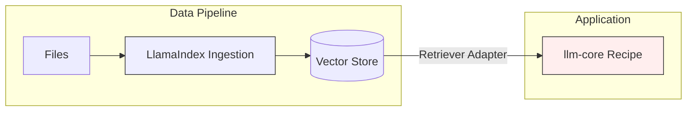

# LlamaIndex Integration

**LlamaIndex (TS)** is the recommended ecosystem for complex data ingestion and retrieval. Its interfaces for Vector Stores and Retrievers are robust and strongly typed.

## Installation

```bash
npm install llamaindex
```

## Features Supported

| Feature           | Support   | Notes                                                   |
| :---------------- | :-------- | :------------------------------------------------------ |
| **Retrievers**    | ✅ Full   | `BaseRetriever` supported.                              |
| **Vector Stores** | ✅ Full   | `BaseVectorStore` and `VectorStoreIndex` supported.     |
| **Embeddings**    | ✅ Full   | `BaseEmbedding` supported.                              |
| **Models**        | ✅ Full   | `LLM` interface supported.                              |
| **Node Parsers**  | ✅ Full   | `TextSplitter` / `NodeParser` supported.                |
| **Query Engine**  | ❌ Opaque | Use Recipes for the logic; use LlamaIndex for the data. |

## Quick Start (Vector Store)

Use LlamaIndex to manage your data (ingestion), and `llm-core` to query it.

```ts
import { Adapter, fromLlamaIndexRetriever } from "@geekist/llm-core/adapters";
import { VectorStoreIndex, Document } from "llamaindex";

// 1. Ingest with LlamaIndex (standard)
const index = await VectorStoreIndex.fromDocuments([
  new Document({ text: "LlamaIndex is great for data." }),
]);

// 2. Wrap the retriever
const plugin = Adapter.retriever("li-index", fromLlamaIndexRetriever(index.asRetriever()));

// 3. Use in Recipe
const wf = Recipe.flow("rag").use(plugin).build();
```

## The "Data Specialist" Pattern

The strongest pattern is to use LlamaIndex for **Ingestion** (loading built from folders, splitting, indexing) and `llm-core` for **Orchestration** (chat loops, reasoning, tool calling).



## Known Limitations

- **Synthesizers**: LlamaIndex `ResponseSynthesizer` is a black box. `llm-core` replaces this with explicit "Generation" steps in a Recipe.
- **Storage Context**: We support the generic `Storage` interface, but deep LlamaIndex-specific storage contexts (like graph stores) may need custom adapters.
